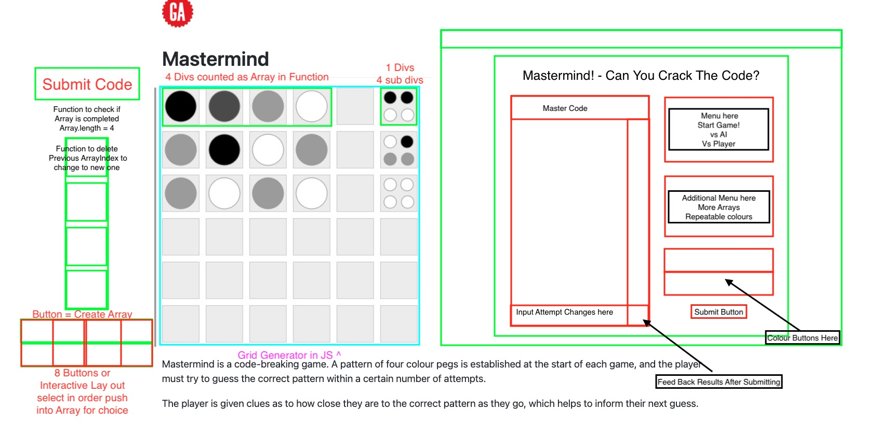

# Mastermind! Make it to Mordor! 

This is the first project from my Software Engineering Immersive course; this was a full stack solo project highlighting the use of HTML, CSS and JavaScript.

# Deployment 

The game is available here -> [To Mordor!](https://bit.ly/3Dj2Kkv) 

# Getting started

1. Access the source code via the ‘Clone or download’ button. 
2. Open the index.html file in your browser of choice to start the game.

# Objective & Language Used 

To create a game using only basic HTML, CSS and JavaScript. 

# Brief 
Mastermind is a classic code breaking game for 2 players, one mastermind and the other the decoder.
The aim of the game is to find out the secret code that your opponent has set up to win within the given amount of trials.
My twist of the game is that the game is set in the world of Middle Earth and you require a select group of heroes to complete the quest and cast the ring into Mount Doom. 
Timeframe: 8 days

# Process 
Day 1
Planning - Design, MVP & Features
I planned using the brief given and highlighted the core MVP of my game with bonuses as milestones. 

I then planned out the layout of the game on the browser and a rough outline where each component will go. 

Day 2
Coding Front first - HTML Boxes 
I created empty divs inside my HTML file and on CSS styled them to have a border of solid 5px and its own specific color along with its separate width and height. 
This highlighted where each component will go and prepared the front end portion of my game. 
Later, I found out that some of this planning would not have been used at the end of the project week. 

Day 3 - 4  
Coding Back End - JavaScript Basic Functionality 
For my MVP, I required the main logic of the game. It required the AI or player to choose 4 characters in a given order in secret and the player to find out who the characters were and what index position they were situated in. 
I aimed to create the grid generation for the game first making a 5x10 grid that the characters will be displayed in once chosen. 
By the end of day 3, I had created a generating grid along with the ability for the AI to randomly choose between 4 of the chosen characters on the array. I haven't coded it to not repeat the selected character yet as I would find out later that this was occurring. 
On day 4, I managed to get the core logic of the game working but was having an issue in regards to the front end interaction once a character has been chosen. 
I made a function that highlighted which character was chosen and called it as imageChange() shown below.

This lets me call the function wherever necessary when a character is chosen to revert back to the blank after the submit is clicked. 

The core functionality in essence was simple as you had to compare 2 arrays between each other. 
The issue came when comparing the location of each character as I needed to use each character’s index location and also compare that. 
I then had to ensure that the character chosen was not already repeated in comparison so the order in which the indicator read the code was vital to the game. 

This was the code I ended up with as it first went through the hidden character list and the chosen character list and established if any of them are the same and in the correct location if so they were removed from the array and enabled the comparison to carry on. 
The second part was checking if any character chosen were present in the secret code but not in the correct location.
With that, I have the very basic functionality of the game set up. 
The other functionally added later were voice clips on click and background music while playing. 

Day 5
Data Gathering - Styling Sources and data gathering
As a fairly simple game premise, I wanted to have a heavy themed game layout. I chose Lord of the Rings as I recently watched the series before starting the course. 
I collected voice clips in an mp4 file and a looped song as background music. 
I also collected 8bit style lord of the rings fellowship characters as I enjoy the aesthetic of 8 bit. 

Day 6-7 
Coding CSS Front End - CSS 
The rest of the time was making sure that each div was in the right location and that the design was aesthetically pleasing. 

Day 8  
MVP Priority and Skipping Functionality & Debugging/Error Handling. 
In the last few days, I decided to skip a few functionalities I was trying to implement as I did not have enough time to research and implement them in a way that works with the game, thus I focused on error handling the game trying to crash it in any way possible myself and placing code that stops the errors from occurring. 

# Completed task
1. Challenges 
I had fun making the game but came across difficulties when coding the logic of the game. On such a challenge was the feedback of looping through the array and indicating which character was present in the secret code. 

2. Known error 
As I planned to have more functionalities than originally planned, there are many styling interactions that do not function as planned. 
One of which is the duplicate secret character code. 

# Wins
1. I was very pleased that I managed to create a working game that is playable for a single player.
2. I was also very pleased with how the website turned out from the styling, theming to the background music and voice clips when characters were chosen.  

# Key Learning 
1. HTML & CSS - I had fun styling the game as I wanted all from scratch, I really enjoyed the theming aspect of the challenge. 
2. JavaScript - I definitely found myself learning a lot more about JavaScript by completing this project. It allowed me to see how the code interacts in certain ways and how it doesn’t function as planned in others, overall I am pleased with the final project within the given time frame. 

# Improvements & Features
I would like to go back and improve upon my code by adding some features that was originally planned such as: 
- 2 player mode
- Difficulty levels via code length or limited number of attempts
- A local storage leaderboard
- Animations to give the game a more responsive feel 
